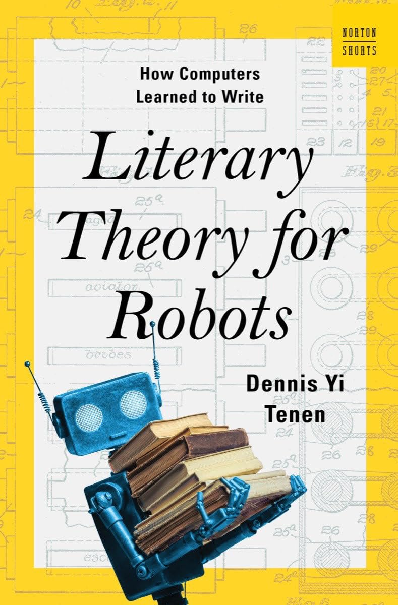

#### Literary Theory for Robots
#### By <a href="https://dennistenen.com/" target="_blank">Dennis Yi Tenen</a>

#### **Links**:
- <a href="https://bookshop.org/p/books/literary-theory-for-robots-how-computers-learned-to-write-dennis-yi-tenen/2a3509f869215deb?ean=9781324105053&next=t" target="_blank">Bookshop</a>
- <a href="https://www.goodreads.com/en/book/show/150778756-literary-theory-for-robots" target="_blank">Goodreads</a>
- <a href="https://app.thestorygraph.com/books/41650978-1cba-4747-8aa5-02c05de27945" target="_blank">StoryGraph</a>

#### **Reading Time**
- <a href="https://howlongtoread.com/books/32185571/Literary-Theory-for-Robots-How-Computers-Learned-to-Write" target="_blank">HowLongToRead</a>: 2 hours and 36 min
- <a href="https://www.kobo.com/us/en/ebook/literary-theory-for-robots-how-computers-learned-to-write-a-norton-short?sId=0a1aca73-1649-4234-a24c-25aa1728f903&ssId=flAp3rVa4n2YBN7aqIOHk&cPos=1" target="_blank">Kobo Reading Time</a>: 3-4 hours
- My Reading Time: 3.6 Hours

#### Genres
- Nonfiction
- Computers
- Advanced Computing
- Artificial Intelligence 

#### BISAC Categories
- Politics
- Society & Current Affairs
- Science & Technology
- Education

Although I am posting this in 2026, I did finish reading this book in Christmas of 2025. It was the 2nd book I read in my return to reading for fun, and let me tell you, that was a mistake. Despite it being an interesting read, it did feel like a chore at times because I struggled to enter a, let’s say, "flow state" of reading. But, that was more due to me struggling in its nonfiction nature than an issue with the book.  
  
I don't remember what I expected given that I had bought it many months before I actually started reading it, but it was interesting in its framing of technologies of the past, as well as the humanities, and how it has shaped today's technology.  
  
Much of the book focuses on the philosophy of language and intelligence. Tenen insists that the field of artificial intelligence must understand the difference between an "artificial" intelligence and a "natural" one. He also urges us to understand the limitations of current language models, both in its approach and the bias that comes from the underlying data.  

Overall I gave it a 4/5 because to me it was a good read, but it’s unlikely I'd read it more than once. Although I'd rarely decide to read any nonfiction book more than once, so in the nonfiction realm it's a 5/5 for me.  

**Rating:** ⭐⭐⭐⭐ out of 5, I recommend.

[My ratings explained.](https://www.carlos.soy/notes/personal-book-rating-system)

