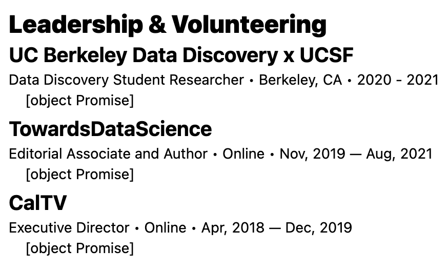
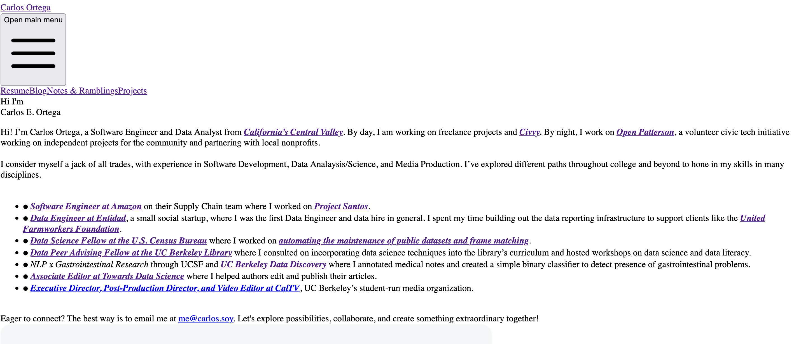

I am typically not one to upgrade packages and framework until absolutely necessary for interesting new features or security reasons. Well, the time has come for me to upgrade my Astro site from v3.6 to v5.2.  

**NOTE**  
Upgrades like this should always be done in a new branch to prevent breaking code in production. Commit often, rollback when needed. Git is your friend. 

Now, the easiest way to do this is the upgrade command.
```
npx @astrojs/upgrade
```

Unfortunately, this did not work in my situation, too many errors. Instead, I went ahead and bulldozed my way through using `npm update` and fixing issues manually as needed.

## Tailwind CSS
As of Tailwind v4, @astrojs/tailwind is no longer maintained and the recommended way to use Tailwind is the Vite plugin. So, I ran a simple command `npm install tailwindcss @tailwindcss/vite`. 
Then in my Astro config:  
```
// Remove
import tailwindcss from "@astrojs/tailwind";

// Add
import tailwindcss from "@tailwindcss/vite";

export default defineConfig({
vite: {
  plugins: [tailwindcss()],
  },
});


```
Create `src/styles/global.css` and add `@import "tailwindcss";`. You will also need to add a line to the frontmatter, see below.

## New Issue
When I try to run the development environment, I get: 
```
1:43:53 PM [vite] Pre-transform error: Failed to load url @astrojs/vercel/serverless 
```
This specific package must be when I was trying out Vercel's serverless functions while they were in beta. Currently, besides hosting, I only use Vercel's web analytics. So, I'll replace that with `@astrojs/vercel`.

Yada yada yada. When in doubt run `npx astro check` to check project for errors and delete node_modules if you're hitting issues with old versions of packages that don't want to go away.

Ran `npx @astrojs/upgrade` to get to v5. No issues with that. 

## Issue with npx add
Had a few packages with issues when trying to run `npm run dev` and then trying to install said packages with `npx astro add`, so instead I went one by one and installed them using `npm install`. I took this opportunity to also remove the packages I no longer used.

## Hybrid rendering

Hybrid rendering is removed and merged with static, which is the default. So must remove `output:"hybrid"` from astro config. 

## Content Collections

Content collections are now deprecated. They should still work for now, possibly with some breaking changes. As long as my present use case works, I'll leave them and focus on the stability of the new site before upgrading them. [Guide to upgrading content collections]([https://docs.astro.build/en/guides/content-collections/](https://docs.astro.build/en/guides/upgrade-to/v5/#legacy-v20-content-collections-api)). The only change I needed to make was fixing a malformed `getCollection` call causing the following issue: 
```
No overload matches this call.
```
But, this was an easy fix.

## Changed Typescript configuration - [env.d.ts](https://docs.astro.build/en/guides/upgrade-to/v5/#changed-typescript-configuration)
Delete `env.d.ts` and add the following to `.tsconfig`:  
```
{
  "extends": "astro/tsconfigs/base",
  "include": [".astro/types.d.ts", "**/*"],
  "exclude": ["dist"]
}
```

## [compiledContent](https://docs.astro.build/en/guides/upgrade-to/v5/#changed-compiledcontent-is-now-an-async-function)  
Compiled content is now an asynchronous function, so it requires `await`. I have a little conundrum, `await` is only allowed in the top-level, while the only place I use `.compiledContent()` is within a map function inside a div. Unfortunately, that does break.



Fortunately, this was an easy fix. Just needed to change in the frontmatter how I packaged the data. Whereas before, I would simply use `Astro.glob` and access the `.compiledContent()` method within my page. I now simply call `.compiledContent()` within my frontmatter and package that in as part of the prop. 

```
// Before
const volunteers = await Astro.glob("../content/volunteer/*.md");

// After
const volunteerFiles = await Astro.glob("../content/volunteer/*.md");
const volunteers = await Promise.all(
  volunteerFiles.map(async (file) => {
    const content = await file.compiledContent();
    return { ...file, content };
  })
);
```

## [astro:content can no longer be used on the client](https://docs.astro.build/en/guides/upgrade-to/v5/#changed-astrocontent-can-no-longer-be-used-on-the-client)  
I'll need to verify I passed the data to props, which I think in most cases I was already doing this.

## [astro.glob Deprecated](https://docs.astro.build/en/guides/upgrade-to/v5/#deprecated-astroglob)
I don't think I used this too much, but I'll replace it when needed. Given that it is deprecated and not immediatley broken (I think), I'll put this task on the backlog.

## What now


Well, I got my website to run off of Astro v5.2.6, but clearly there's still some kinks to fix. 
5 minutes of searching later...oops. That was my bad. I missed that we now have to add the following on the frontmatter of .astro pages:
```
---
import "../styles/global.css";
---
```
All of my pages use a `Primary.astro` layout, so adding it to that was an easy fix.

Most of the site seems to be working fine. But clearly the compiledContent issue is something that needs fixing sooner rather than later.


Also, now that Tailwind has moved from an Astro integration to Vite plugin, it seems my Tailwind Typography plugin is no longer configured correctly and I'll need to re-install as my blog/notes depend on it to look decent. 

Another easy fix! Given that it was still installed via npm, I just had to add one line to the `global.css` stylesheet:
```
@plugin "@tailwindcss/typography";
```
